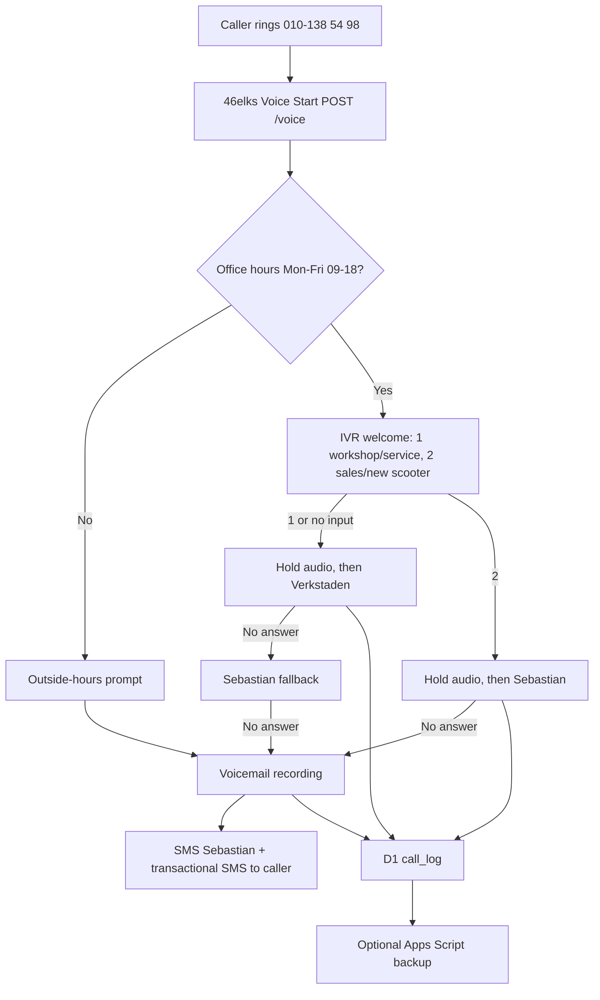

# Nordic E-Mobility 46elks Callflow Worker

Cloudflare Workers webhook for Nordic E-Mobility's 46elks workshop number.

The current routing is Verkstaden-first for workshop calls:

- Option 1 or no input: Verkstaden -> Sebastian fallback -> voicemail.
- Option 2: Sebastian/sales -> voicemail.
- Outside office hours: outside-hours prompt -> voicemail.

## Architecture



## Local Setup

```bash
cd nemob-callflow
npm install
npm run check
```

Use local Wrangler through npm/npx if global `wrangler` is not installed:

```bash
npx wrangler --version
npx wrangler login
```

## Cloudflare Setup

Create resources:

```bash
npx wrangler d1 create nemob-callflow
npx wrangler kv namespace create CALLFLOW_KV
```

Copy the returned IDs into `wrangler.toml`, replacing:

- `REPLACE_WITH_D1_DATABASE_ID`
- `REPLACE_WITH_KV_NAMESPACE_ID`

Run migration:

```bash
npx wrangler d1 execute nemob-callflow --remote --file=migrations/0001_init.sql
```

Set secrets:

```bash
npx wrangler secret put ELKS_USERNAME
npx wrangler secret put ELKS_PASSWORD
npx wrangler secret put ELKS_FROM_NUMBER
npx wrangler secret put ELKS_ALLOWED_IPS
npx wrangler secret put REQUIRE_ELKS_SIGNATURE
npx wrangler secret put SEBASTIAN_NUMBER
npx wrangler secret put WORKSHOP_NUMBER
npx wrangler secret put ADMIN_KEY
npx wrangler secret put INTRO_MP3_URL
npx wrangler secret put HOLD_MUSIC_MP3_URL
npx wrangler secret put VOICEMAIL_PROMPT_MP3_URL
npx wrangler secret put OFFICE_HOURS_PROMPT_MP3_URL
```

Optional:

```bash
npx wrangler secret put ELKS_WEBHOOK_SECRET
npx wrangler secret put APPS_SCRIPT_WEBHOOK_URL
```

Recommended current 46elks IP allowlist from their docs:

```text
176.10.154.199,85.24.146.132,185.39.146.243,2001:9b0:2:902::199
```

Deploy:

```bash
npx wrangler deploy
```

Set 46elks number `Voice Start` to:

```text
https://nemob-callflow.workers.dev/voice
```

## Prompt MP3s

The site serves the current audio prompts from:

- `https://www.nordicemobility.se/audio/welcome.mp3`
- `https://www.nordicemobility.se/audio/hold-music.mp3`
- `https://www.nordicemobility.se/audio/voicemail-prompt.mp3`
- `https://www.nordicemobility.se/audio/outside-hours-prompt.mp3`

Regenerate with ElevenLabs:

```bash
cd nemob-callflow
ELEVENLABS_API_KEY=... npm run voice:elevenlabs
```

The helper writes MP3 files to the repo-level `audio/` folder. Push/deploy the website so Netlify publishes them before pointing Worker secrets at those URLs.

Required scripts:

Welcome:

> Du hör en automatisk röst från Nordic E-Mobility. Välkommen. Tryck 1 för verkstad, service och bokning. Tryck 2 för ny elscooter, försäljning eller inbyte. Vi kopplar dig direkt.

Voicemail:

> Du hör en automatisk röst från Nordic E-Mobility. Du har kommit till vår röstbrevlåda. Lämna ditt namn, telefonnummer och vad det gäller efter pipet. Genom att lämna ett meddelande godkänner du att samtalet spelas in och lagras i 90 dagar för att vi ska kunna återkomma. Tryck fyrkant när du är klar.

Outside hours:

> Du hör en automatisk röst från Nordic E-Mobility. Du har ringt utanför våra öppettider, måndag till fredag 9 till 18. Lämna ditt namn, telefonnummer och vad det gäller efter pipet, så hör vi av oss nästa arbetsdag. Genom att lämna ett meddelande godkänner du att samtalet spelas in och lagras i 90 dagar för att vi ska kunna återkomma.

Hold:

> Ett ögonblick, vi kopplar dig vidare.

## Operator Instructions

Verkstaden is called first for option 1 and default/no-input calls. Sebastian is called for option 2 sales/new-scooter calls and as fallback when Verkstaden misses option 1.

Do not use mid-call DTMF transfer. If Verkstaden gets a technical question he cannot answer, he should use the phone's native carrier transfer/conference feature to bring Sebastian into the call.

Both Sebastian and Verkstaden should save `010-138 54 98` as `NEMOB Verkstad` so routed work calls are obvious.

## Office Hours

Office hours live in `src/officeHours.ts`.

- Monday-Friday 09:00-18:00 Europe/Stockholm
- Saturday-Sunday closed
- Swedish public holidays closed

The 2026 and 2027 holiday lists are hardcoded in `SWEDISH_PUBLIC_HOLIDAYS`. Add new dates as `YYYY-MM-DD`.

## GDPR Notes

Data collected:

- call id
- caller phone number
- timestamp
- route/IVR choice
- duration
- answered/missed/voicemail status
- recording URL when voicemail exists

Retention:

- D1 call logs are purged after 90 days by the scheduled worker.
- Voicemail audio is not copied to R2.
- 46elks recording retention must be configured/verified in 46elks, target max 90 days.

Auto-SMS to caller is transactional only. Do not add marketing copy or address to that SMS.

## Stats

Authenticated endpoint:

```text
GET /stats?key=ADMIN_KEY
```

## Testing

Start local dev:

```bash
npx wrangler dev
```

In another terminal:

```bash
BASE_URL=http://127.0.0.1:8787 bash test/scenarios.sh
```

Check D1 rows:

```bash
npx wrangler d1 execute nemob-callflow --local --command "SELECT * FROM call_log ORDER BY id DESC LIMIT 10"
```

## Acceptance Checklist

- `npm run check`
- D1 and KV IDs are real in `wrangler.toml`
- `npx wrangler d1 execute nemob-callflow --remote --file=migrations/0001_init.sql`
- all secrets are set
- `npx wrangler deploy`
- 46elks Voice Start points to `https://nemob-callflow.workers.dev/voice`
- live test option 1
- live test option 2
- live test missed-call voicemail
- verify SMS notifications
- verify D1 rows
