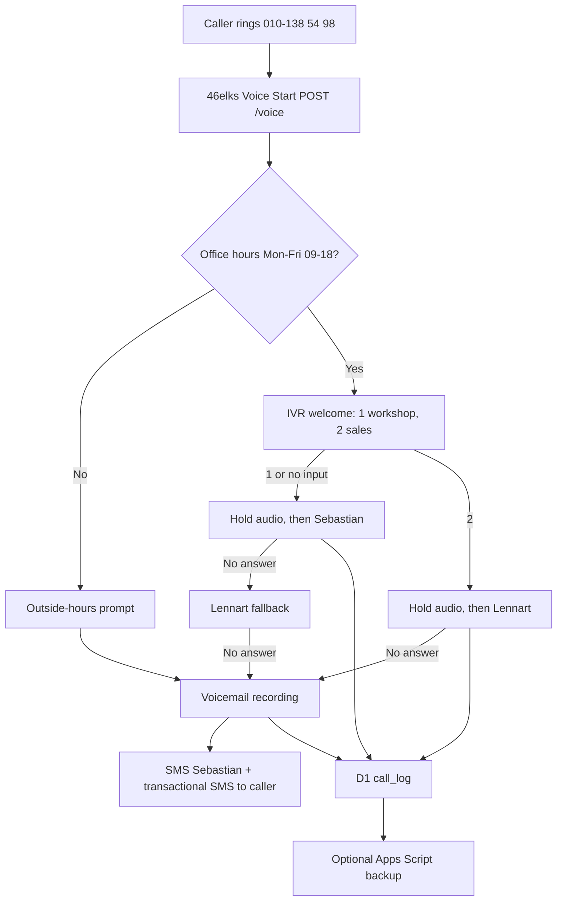

# Nordic E-Mobility 46elks Callflow Worker

Cloudflare Workers webhook for Nordic E-Mobility's 46elks workshop number.

Important implementation note: the original prompt used a simplified IVR shape and `record.timeout`. The code here follows the current 46elks docs: IVR is returned as `{"ivr":"https://..."}` with digit routes, and recording uses `timelimit`. 46elks also documents IP firewalling as the callback-origin check; a custom optional HMAC check is included, but `x-elks-signature` is not documented by 46elks at the time this was built.

References:
- 46elks call actions: https://46elks.com/docs/call-actions
- 46elks IVR action: https://46elks.com/docs/voice-ivr
- 46elks record action: https://46elks.com/docs/voice-record
- 46elks callback origin IPs: https://46elks.com/docs/verify-callback-origin

## Architecture



## Setup

Install dependencies:

```bash
cd nemob-callflow
npm install
```

Create Cloudflare resources:

```bash
wrangler d1 create nemob-callflow
wrangler kv namespace create CALLFLOW_KV
```

Copy the returned IDs into `wrangler.toml`.

Run migration:

```bash
wrangler d1 execute nemob-callflow --file=migrations/0001_init.sql
```

Set every secret:

```bash
wrangler secret put ELKS_USERNAME
wrangler secret put ELKS_PASSWORD
wrangler secret put ELKS_FROM_NUMBER
wrangler secret put ELKS_WEBHOOK_SECRET
wrangler secret put ELKS_ALLOWED_IPS
wrangler secret put REQUIRE_ELKS_SIGNATURE
wrangler secret put SEBASTIAN_NUMBER
wrangler secret put LENNART_NUMBER
wrangler secret put ADMIN_KEY
wrangler secret put APPS_SCRIPT_WEBHOOK_URL
wrangler secret put INTRO_MP3_URL
wrangler secret put HOLD_MUSIC_MP3_URL
wrangler secret put VOICEMAIL_PROMPT_MP3_URL
wrangler secret put OFFICE_HOURS_PROMPT_MP3_URL
```

Recommended current 46elks IP allowlist from their docs:

```text
176.10.154.199,85.24.146.132,185.39.146.243,2001:9b0:2:902::199
```

Deploy:

```bash
wrangler deploy
```

Set 46elks number `Voice Start` to:

```text
https://nemob-callflow.workers.dev/voice
```

## How To Swap Numbers

Change Sebastian:

```bash
wrangler secret put SEBASTIAN_NUMBER
```

Change Lennart:

```bash
wrangler secret put LENNART_NUMBER
```

Change public workshop caller ID:

```bash
wrangler secret put ELKS_FROM_NUMBER
```

Use E.164 format, for example `+46700243319`.

## Prompt MP3s

Host MP3 files at stable public HTTPS URLs. For telephony, export mono MP3, 8 kHz or 16 kHz, 64 kbps if possible.

Required scripts:

Welcome:

> Valkommen till Nordic E-Mobility. Tryck 1 for verkstad, tryck 2 for forsaljning. Vi kopplar dig direkt.

Voicemail, mandatory consent:

> Du har kommit till Nordic E-Mobilitys rostbrevlada. Lamna ditt namn, telefonnummer och vad det galler efter pipet. Genom att lamna ett meddelande godkanner du att samtalet spelas in och lagras i 90 dagar for att vi ska kunna aterkomma. Tryck fyrkant nar du ar klar.

Outside hours:

> Hej! Du har ringt utanfor vara oppettider man-fre 9-18. Lamna ett meddelande efter pipet sa hor vi av oss pa morgonen.

Hold:

> Royalty-free 5-15 second loop. 46elks can play it before connecting. It will not play during the ringing leg.

## Operator Instructions

Sebastian is called first for option 1 and default/no-input calls.

Lennart is called directly for option 2 and as fallback when Sebastian misses option 1.

Do not use mid-call DTMF transfer. If Sebastian needs to transfer a live call, use the phone's native carrier transfer/conference feature. On iOS/Android this is usually done by adding Lennart as a second call and merging/transferring according to carrier support.

Both Sebastian and Lennart should save `010-138 54 98` as "NEMOB Verkstad" so routed work calls are obvious.

## Office Hours

Office hours live in `src/officeHours.ts`.

Current rule:

- Monday-Friday 09:00-18:00 Europe/Stockholm
- Saturday-Sunday closed
- Swedish public holidays closed

The 2026 holiday list is hardcoded in `SWEDISH_PUBLIC_HOLIDAYS_2026`. Add new dates as `YYYY-MM-DD`.

## GDPR Compliance Notes

Data collected:

- call id
- caller phone number
- timestamp
- route/IVR choice
- duration
- answered/missed/voicemail status
- recording URL when voicemail exists

Retention:

- D1 call logs are purged after 90 days by the scheduled worker.
- Voicemail audio is not copied to R2. 46elks recording storage/fetch retention must be configured/verified in 46elks. Their public record-action docs currently mention that recordings are fetched from a `wav` URL after recording.

Lawful basis:

- Voicemail prompt includes explicit consent wording before recording.
- Auto-SMS to caller is transactional only, with no marketing copy and no address.

Data subject access:

```bash
wrangler d1 execute nemob-callflow --command "SELECT * FROM call_log WHERE caller_e164 = '+467...'"
```

Delete a caller's rows:

```bash
wrangler d1 execute nemob-callflow --command "DELETE FROM call_log WHERE caller_e164 = '+467...'"
```

## Cost Estimate

Cloudflare Workers free tier should be enough for normal workshop call volume. D1/KV usage is tiny.

46elks costs remain the real cost driver:

- incoming/outgoing call minutes according to 46elks pricing
- SMS notifications roughly around the current 46elks SMS rate, commonly about 0.30 SEK each, verify current pricing before relying on it

## Stats

Authenticated endpoint:

```text
GET /stats?key=ADMIN_KEY
```

Returns:

```json
{
  "calls_today": 23,
  "missed_today": 4,
  "avg_duration_s": 187,
  "fallback_rate": 0.18,
  "office_hours_calls": 19,
  "outside_hours_calls": 4
}
```

## Testing

Start local dev:

```bash
wrangler dev
```

In another terminal:

```bash
BASE_URL=http://127.0.0.1:8787 bash test/scenarios.sh
```

Check logs:

```bash
wrangler d1 execute nemob-callflow --local --command "SELECT * FROM call_log ORDER BY id DESC LIMIT 10"
```

## Troubleshooting

403 from worker:

- Check `ELKS_ALLOWED_IPS`.
- For local curl tests, leave `ELKS_ALLOWED_IPS` empty or use the local forwarded IP.
- Keep `REQUIRE_ELKS_SIGNATURE=false` unless a real signature/proxy header is configured.

46elks does not follow IVR choice:

- Confirm `/voice` returns `ivr`, `digits`, `timeout`, `repeat`, and digit keys.
- Confirm MP3 URL is public HTTPS and reachable.

No voicemail SMS:

- Confirm `ELKS_USERNAME`, `ELKS_PASSWORD`, and `ELKS_FROM_NUMBER`.
- Confirm `/event/voicemail-saved` receives `from` and `wav`.

No D1 rows:

- Confirm `wrangler.toml` has the real D1 database ID.
- Run migration in the same environment you deploy to.

## Acceptance Checklist

- `npm run check`
- `wrangler d1 execute nemob-callflow --file=migrations/0001_init.sql`
- `wrangler deploy`
- Set 46elks Voice Start URL to `https://nemob-callflow.workers.dev/voice`
- Call the workshop number
- Test option 1
- Test option 2
- Test missed call voicemail
- Verify SMS notifications
- Verify D1 rows
